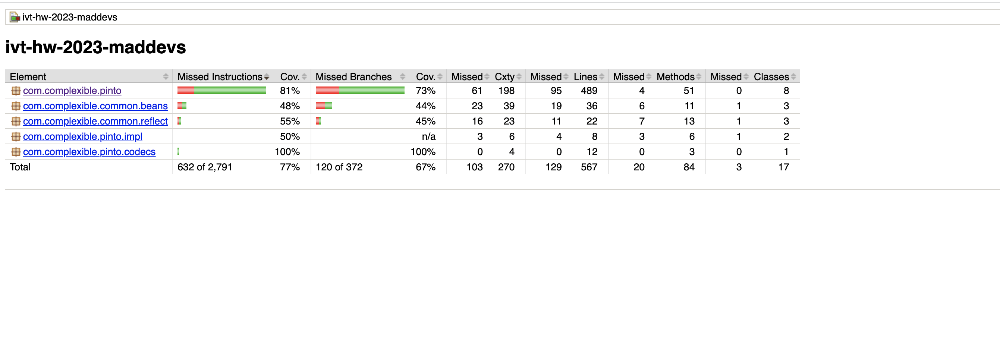
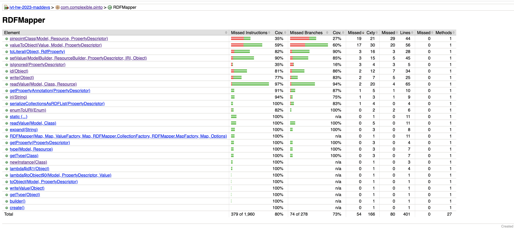
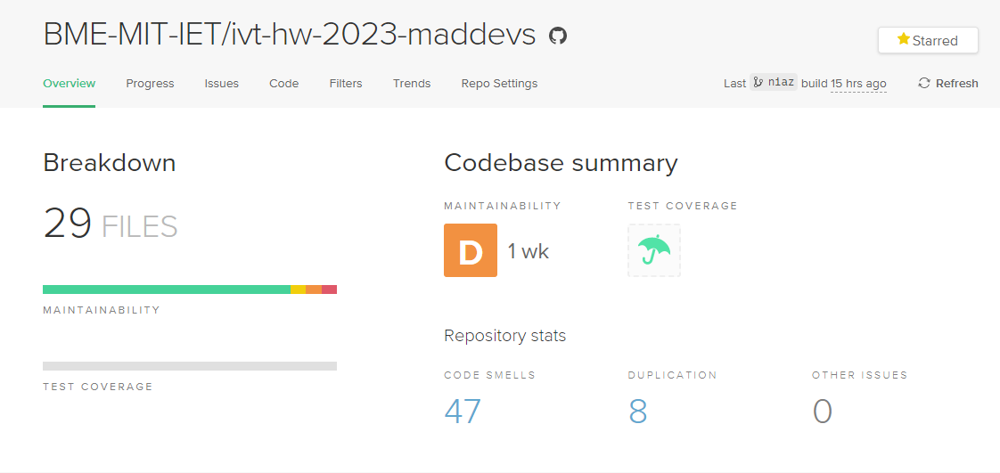
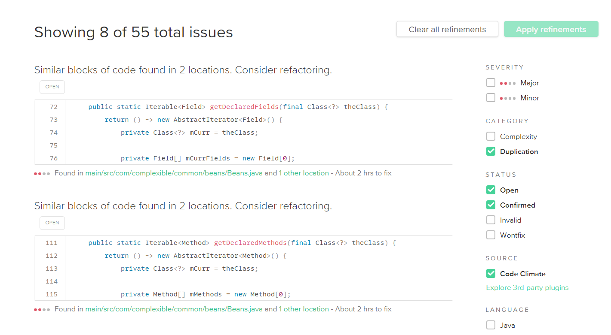

# Documentation

## Issue #1: Updating Gradle and Modifying Deprecated Configurations

### Overview

During our efforts to build the project, we encountered several issues that were rooted in the 
outdated version of Gradle that we were using. It quickly became clear that we needed to 
update Gradle to a newer version to solve these problems and align ourselves with the current 
best practices.

Upon updating Gradle, we found that several configurations used in our `build.gradle` file were 
deprecated or completely removed in the newer versions of Gradle. This required us to revise our 
`build.gradle` file and update our dependency configurations.

### Main Results

The transition to a newer version of Gradle and the update of the `build.gradle` file was successful.
We replaced the `compile` configuration with `implementation` and `testCompile` with `testImplementation`
as per the new Gradle conventions.

By adapting to these new conventions, we have managed to bring our project up to date with the current 
Gradle practices, enhancing our build performance and dependency management. This update also ensures 
that our project can leverage the latest features and improvements offered by Gradle.

### Lessons Learnt

This process reiterated the importance of maintaining updated build tools in our development 
environment. By updating Gradle and aligning our project with the latest conventions, we have 
improved the efficiency of our builds and learned a great deal about Gradle's dependency management
and the implications of its different configurations.

Going forward, we have recognized the need to stay updated with the changes and enhancements in our
build tools to maximize our development efficiency and ensure the robustness of our builds.

## Issue: Generate Code Coverage Report

### Overview

- Framework: JaCoCo
    - Tool Version: 0.8.10

The code coverage report for the our gradle project provides insights into the extent of code coverage achieved during the testing phase. The project utilizes JaCoCo (Java Code Coverage) library, a popular code coverage framework, with a specified tool version of 0.8.10.

By analyzing the report, we could identify the percentage of code covered by tests, pinpoint specific areas with low coverage, and prioritize our efforts to improve the test suite. The report typically includes metrics such as the overall coverage percentage, coverage trends over time, and specific coverage details for each class or package.

To run code coverage suit run following command: `./gradlew jacocoTestReport ` This will generate `html` file under `build/reports/jacoco/test/html/index.html`

### Main Results

### Coverage metrics for the "com.complexible.pinto" package:

- Instructions Coverage: 81%
- Branches Coverage: 73%
- Cyclomatic Complexity: 198
- Lines of Code: 489
- Number of Methods: 51
- Number of Classes: 8

These metrics provide a snapshot of the code coverage achieved within the "com.complexible.pinto" package. The Instructions Coverage indicates that 81% of the instructions within the package have been executed by the tests. Similarly, the Branches Coverage indicates that 73% of the branch points have been exercised.

The Cyclomatic Complexity metric measures the complexity of the code based on the number of decision points and flow control statements. A value of 198 suggests that the code within the package has a moderate level of complexity.

The Lines of Code metric counts the total number of lines of code covered within the package, which in this case is 489. The Number of Methods indicates the count of methods defined and covered within the package, which is 51. Finally, the Number of Classes signifies the total number of classes present in the "com.complexible.pinto" package, which is 8.

### Coverage metrics for the "RDFMapper" class:

- Instructions Coverage: 80%
- Branches Coverage: 73%
- Cyclomatic Complexity: 166
- Lines of Code: 401
- Number of Methods: 27
- Number of Classes: 1

These metrics provide an overview of the code coverage achieved within the RDFMapper class. The Instructions Coverage metric indicates that 80% of the instructions within the class have been executed by the tests. The Branches Coverage metric signifies that 73% of the branch points within the class have been exercised.

The Cyclomatic Complexity metric measures the complexity of the code based on the number of decision points and flow control statements. A value of 166 suggests that the RDFMapper class has a moderate level of complexity.

The Lines of Code metric represents the total number of covered lines within the RDFMapper class, which amounts to 401 lines. The Number of Methods metric indicates that there are 27 methods defined and covered within the class. Lastly, the Number of Classes metric indicates that there is only one class present, which is the RDFMapper class itself.

### Lessons Learnt

These metrics help in evaluating the overall quality of the testing efforts and provide insights into the coverage achieved at different levels within the Pinto project. They can guide us in identifying areas of the code that require further testing and optimization to improve overall code coverage.

# Untitled

### **Static Analysis with CodeClimate Tool**

As part of our code quality improvement process, we utilized the CodeClimate tool for static code analysis. During the analysis, the tool successfully identified duplication problems in the **`RDFMapper`** and **`Beans`** classes. These duplications violated the DRY (Don't Repeat Yourself) principle and had the potential to affect code maintainability and readability.

To address these duplication issues, we created corresponding issues and promptly resolved them. By carefully reviewing the identified problems, we were able to devise effective solutions to eliminate the duplication.

The identified duplication issues were resolved by extracting the common logic into separate methods, namely **`processValue`** and **`processMapEntry`**. This approach allowed us to centralize the duplicated code blocks, promote code reusability, and improve overall code quality.

Issue #9 [Issue Name: **Code Duplication in Beans Class**](https://github.com/BME-MIT-IET/ivt-hw-2023-maddevs/issues/9)

**Description**

The **`Beans`** class in the codebase previously exhibited code duplication in the **`getDeclaredFields`** and **`getDeclaredMethods`** methods. This duplication caused maintenance difficulties, increased the potential for bugs, and reduced code maintainability. To address this issue, the code has been refactored to eliminate the duplication and promote code reuse.

### **Refactoring Details**

The following changes were made to the **`Beans`** class:

1. A private method named **`getDeclaredElements`** was introduced to encapsulate the common logic for retrieving declared fields and declared methods.
2. The **`getDeclaredFields`** and **`getDeclaredMethods`** methods were modified to call the **`getDeclaredElements`** method, passing the appropriate element type.
3. The duplicated code blocks were removed, resulting in a more concise and maintainable implementation.

### **Benefits**

By eliminating code duplication, the modified **`Beans`** class offers the following benefits:

- Improved code maintainability: The refactored code promotes code reuse and reduces the effort required for future modifications and bug fixes.
- Enhanced readability: The removal of duplicated code blocks improves code clarity and makes it easier for developers to understand the functionality.
- Reduced potential for bugs: Code duplication increases the risk of introducing bugs when making changes. With the elimination of duplication, the potential for introducing such bugs is significantly reduced.

### **Usage**

To leverage the updated **`Beans`** class in your project, follow these steps:

1. Replace the existing **`Beans`** class implementation with the modified version provided.
2. Recompile the project to ensure that the changes are incorporated.
3. Review and test the affected parts of your codebase to ensure that the modifications do not introduce any regressions or unexpected behavior.

### **Conclusion**

The code duplication in the **`Beans`** class has been successfully eliminated through the refactoring process. The modified class offers improved code maintainability, enhanced readability, and reduced potential for bugs. By incorporating this updated version into your project, you can benefit from these improvements and ensure a more efficient and maintainable codebase.

Issue #10 [Refactor Duplicated Code Blocks in 'readValue' Method of 'RDFMapper'](https://github.com/BME-MIT-IET/ivt-hw-2023-maddevs/issues/10)

## **Refactor Duplicated Code Blocks in 'readValue' Method**

### **Issue Description**

The **`readValue`** method in the **`RDFMapper`** class contained duplicated code blocks for handling the conversion of values, violating the DRY (Don't Repeat Yourself) principle. This duplication led to decreased code maintainability and readability.

### **Solution**

To address the issue, the duplicated code blocks were refactored by extracting the common logic into a separate method called **`processValue`**. This method handles the common conversion logic for both literals and resources, reducing code duplication and improving code structure.

### **Benefits**

- Code Reusability: The **`processValue`** method promotes code reuse by consolidating the common logic for value conversion. This eliminates the need to duplicate the code for handling literals and resources in multiple places, leading to more maintainable code.
- Improved Readability: By extracting the common logic into a separate method, the code becomes more concise, readable, and easier to understand, as the conversion logic is centralized in one place.
- Modularity: The separation of concerns achieved through the **`processValue`** method increases modularity and helps in isolating and managing the specific functionality of value conversion.

### **Usage**

To utilize the refactored code:

1. Replace the duplicated code blocks for value conversion in the **`readValue`** method of the **`RDFMapper`** class with a call to the **`processValue`** method.
2. Pass the appropriate parameters to the **`processValue`** method to convert the values.

### **Conclusion**

By refactoring the **`readValue`** method in the **`RDFMapper`** class and extracting the duplicated code blocks into the **`processValue`** method, the codebase has been improved in terms of code reusability, readability, and modularity. Developers can now use the **`processValue`** method to handle value conversion, resulting in cleaner, more maintainable code.

Feel free to customize the documentation further based on your specific requirements and context.

Issue #11 [Refactor Duplicated Code Blocks in Map Entry Processing](https://github.com/BME-MIT-IET/ivt-hw-2023-maddevs/issues/11)

## **Refactor Duplicated Code Blocks in 'RDFMapper' Class**

### **Issue Description**

The code in the **`RDFMapper`** class contained duplicated code blocks for processing map entries, violating the DRY (Don't Repeat Yourself) principle. This duplication led to decreased code maintainability and readability.

### **Solution**

To address the issue, we performed the following steps:

1. Extracted the duplicated code blocks related to value conversion into a separate method called **`processValue`**. This method takes the **`theGraph`** and **`value`** as parameters and handles the conversion logic for literals and resources.
2. Extracted the duplicated code blocks related to map entry processing into a separate method called **`processMapEntry`**. This method takes the **`theGraph`**, **`aMapEntry`**, and **`aMap`** as parameters and handles the retrieval of key-value pairs from the graph, invokes **`processValue`** for value conversion, and adds the converted objects to the map.
3. Modified the existing code to call the **`processMapEntry`** method instead of duplicating the code blocks for map entry processing.

### **Benefits**

- Code Reusability: By extracting the duplicated code blocks into separate methods, we promote code reuse and eliminate the need for duplicating the logic in multiple places. This leads to cleaner and more maintainable code.
- Improved Readability: The refactored code improves code readability by centralizing the common logic into dedicated methods. This makes the code easier to understand and follow.
- Modularity: The separation of concerns achieved through the **`processValue`** and **`processMapEntry`** methods increases modularity and allows for better organization and management of the codebase.

### **Usage**

To utilize the refactored code:

1. Replace the duplicated code blocks for value conversion with a call to the **`processValue`** method, passing the appropriate parameters.
2. Replace the duplicated code blocks for map entry processing with a call to the **`processMapEntry`** method, providing the required parameters.

### **Conclusion**

By refactoring the code in the **`RDFMapper`** class, we have successfully eliminated duplication and improved the overall quality of the codebase. The extraction of common logic into the **`processValue`** and **`processMapEntry`** methods enhances code reusability, readability, and modularity. Developers can now use these methods for value conversion and map entry processing, resulting in cleaner and more maintainable code.

By utilizing the CodeClimate tool and actively addressing the identified issues, we proactively maintained a high standard of code quality, ensuring that our codebase remains clean, maintainable, and efficient.

## Issue: Manual code review needed
### Overview

This issue aims to highlight the necessity of a comprehensive manual code review on certain parts of our application. The focus is to ensure the quality, efficiency, and security of the involved components, making this task a high priority.

### Main Results

During the manual code review process, the following areas have been identified as needing attention:

**Comments and Documentation**: The comments could be improved.

**Exception Handling**: In the **`newInstance`** method, all exceptions are caught and then a **`RDFMappingException`** is thrown. This is a bit generic and loses the original exception's stack trace. It would be better to catch specific exceptions and throw a new exception that includes the original exception as its cause.

**Duplicate Code**: In the **`readValue`** method, the way single and multiple values are handled for non-Collection, non-Map properties and Map properties is almost identical. This needs refactoring.

**Error Handling**: In the **`readValue`** method, some potential exceptions are handled in a catch-all block, which may make it difficult to understand and debug specific problems. Consider using more specific catch blocks and provide meaningful error messages.

The **`setValue`** and **`valueToObject`** methods are quite large and perform a variety of different actions depending on the input parameters. Consider breaking these methods into smaller ones, each responsible for one specific task. This will make your code easier to read, test, and maintain.

- The **`valueToObject`** method contains a long list of if-else statements that makes the code complex and hard to read.
- For **`setValue`** method: In methods like **`handleCollection()`**, **`handleMap()`**, and **`handleObject()`**, you could further extract smaller methods if those methods are still too long and complex. The main goal here is to make each method do one thing and do it well, which is also known as the Single Responsibility Principle (SRP).

In the **`enumToURI`** method, a NoSuchFieldException is caught but an AssertionError is thrown with no message. Providing a meaningful message here could make debugging easier.

For **`valueToObject`**: This simplifies the **`valueToObject`** method and makes it easier to understand the code because the logic for handling different types of values (Literal, Enum, Resource) is separated into their own methods.

The **`toLiteral`** method could use a comment explaining what it does and its parameters.

**Java 8 or newer**: For Java 8, we can use  **`Class.getDeclaredConstructor().newInstance()`** instead of **`Class.newInstance()`**, as the latter is deprecated due to its insufficient exception handling

**Separation of responsibilities**: The **`DefaultCollectionFactory`** and **`Dates2`** classes perform very different functions, and as such, it may be better to separate them into separate files for clarity and to improve maintainability. Dates2 moved to new commons/util package
- There seems to be recursive call in **`asDate()`** method in case of **`ParseException`**, which can lead to infinite loop if the exception keeps occurring. This is dangerous and should be avoided. Replaced it with the exception:
- `throw new RuntimeException("Unable to parse date string: " + theDate, pe);`

## Conclusion and Lessons Learned

The code review process has highlighted several areas in the codebase that require improvement. These range from minor issues, such as improving comments and documentation, to more significant structural issues, such as method complexity and code duplication.

Key lessons learned include:

1. **Exception Handling**: It's essential to handle exceptions appropriately, retaining the original exception's stack trace whenever possible for easier debugging. Specific exceptions should be caught and rethrown as new exceptions with the original cause included.

2. **Code Duplication**: It's crucial to avoid duplicating code. If similar code is used in multiple places, it's a sign that the code should be refactored, often into a separate method that can be reused.

3. **Method Complexity**: Large, complex methods should be broken down into smaller, more manageable methods, each with a single responsibility. This approach aligns with the Single Responsibility Principle (SRP) and results in code that is easier to read, test, and maintain.

4. **Error Messages**: Meaningful error messages are essential for understanding and debugging issues. If an AssertionError or other exception type is thrown, it should be accompanied by a useful message.

5. **Code Documentation**: Code comments and documentation should be clear and informative. They should explain what a method does, its parameters, and its return values.

6. **Separation of Responsibilities**: Different functionalities should be separated into different classes or files for clarity and ease of maintenance.

In general, this review emphasized the importance of good software development practices, including the principles of clean code, such as SRP, DRY (Don't Repeat Yourself), and clear documentation. Following these principles will lead to more maintainable, understandable, and efficient code.